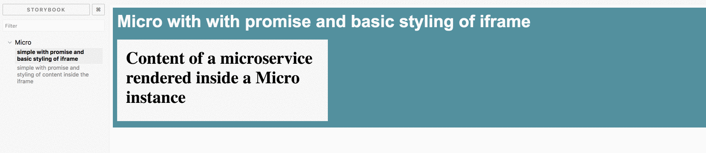

# react-micro
React component for displaying UI microservices.



## Installation

```
yarn add react-micro
```

or

```
npm install react-micro
```

## Running a Demo
To run a local demo of `react-micro`:
- clone this repo
- install dependencies
- run `yarn storybook`.

## Usage
Currently supports rendering content obtained via promise inside an iframe.

```
<Micro
    type="iframe"
    contentPromise={promise}/>
```

Detailed examples can be found in `stories/index.js` file containing Storybook stories.